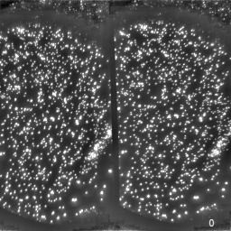
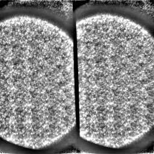
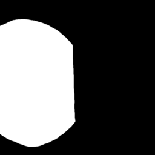
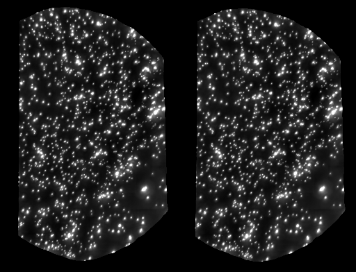

# Calibrate and apply transformations to beam splitter samples

This protocol describes how to estimate the lens deformation and relative alignment of many images of the same sample imaged through a beam splitter system or lens-array. As an example, we will use data from a custom built beam splitter system with substantial lens distortion.

## Calibration samples

Image a sample with dense texture covering the entire field of view as a mosaic at least 3x3 overlapping tiles. The overlap should be more then 50% such that all sample regions are imaged in different regions of the image. We use a sample with fluorescent beads.

<figcaption>Animation through beads sample stack captured through a beam splitter system.</figcaption>

<figcaption>Animation through a 5×5 acquisition of 50% overlapping tiles of the beads sample. Contrast normalized max intensity projections.</figcaption>

## One mask for each split image

Create a mask for each split image as amn 8-bit PNG or TIF file. To find the region with content, we averaged all tiles and then manually painted the mask (foreground 255, background 0). The mask should show the full area that you want to be corrected. It should also hide content that could be confused for real data like background patterns or structures from the beam path. Most importantly, it must not include image data from more than one beam path or micro-lens, otherwise the calibration may get confused which one to pick.

&nbsp;&nbsp;&nbsp;&nbsp;&nbsp;&nbsp;<figcaption>Average projection of the max intensity projections of all beads sample tiles and the corresponding mask for the left and right field of view.</figcaption>

## Run calibration

All tiles must be in a single directory as TIF or LSM files. Create a file `input.json` in this directory or elsewhere that specifies the input file name pattern (this can be as simple as `".*\\.tif"`), the names of the mask files, and labels for the resulting transformations. An example file could look like this:

```json
{
  "patterns": ["X_-.*\\.tif"],
  "masks": ["mask-left.tif", "mask-right.tif"],
  "labels": ["left", "right"]
}
```

Call the calibration tool with the following mandatory parameters

```bash
lens-correct calibrate-split \
  -i /home/you/input-directory \
  -o /home/you/output-directory \
  -n calibration-label \
  -j /home/you/input-directory/input.json
```

Here is the full help page of the tool:

```bash
Usage: lens-correct calibrate-split [-hV] -i=<inputDir> -j=<inputParamsPath>
                                    -n=<projectName> -o=<outputDir>
                                    [-p=<calibrationParamsPath>]
Calibrate lens distortion and align split-images or lens arrays
  -h, --help                 Show this help message and exit.
  -i, --input=<inputDir>     input directory
  -j, --input-params=<inputParamsPath>
                             path to input parameters file containing patterns,
                               masks, and labels
  -n, --name=<projectName>   project name for output files and transformation
                               labels
  -o, --output=<outputDir>   output directory
  -p, --calibration-params=<calibrationParamsPath>
                             path to calibration parameters file (default:
                               built-in calibration-params.json)
  -V, --version              Print version information and exit.
```

Custom calibration parameters can be provided if the [defaults](../src/main/resources/calibration-params.json) don't work.

## Results

The tool uses [TrakEM2](https://imagej.net/plugins/trakem2/) in headless mode to find a lens-correction and alignment model for all split images. It first generates contrast normalized max intensity projections of all inputs stacks (as shown in the figures above), and then create a TrakEM2 project and perform several montaging, lens-correction, and alignment steps. The resulting models will be exported to a JSON file `$outputDir/$projectName.json`.

This `$outputDir` will also include the TrakEM2 project and the exported max intensity projections. This project can be opened in [Fiji](https://fiji.sc/) to check the results and to get an idea how the whole process worked. It contains an aligned series of lens-distortion corrected split-tile mosaics.

<figcaption>Animated comparison of the alignment of the two split FOVs before (left) and after (right) lens-distortion correction.</figcaption>

## Apply a calibration to an image stack

To apply the calibration and alignment models to image stacks captured with the same imaging setup, call the apply tool

```bash
lens-correct apply-split \
  -i /home/you/input.tif \
  -o /home/you/output.tif \
  -t /home/you/input-directory/input.json
```

Here is the full help page of the tool:

```bash
Usage: lens-correct apply-split [-ahV] -i=<inputPath> -o=<outputPath>
                                [-r=<meshResolution>] -t=<transformPath>
Apply lens-distortion correction and alignment to stacks of split-images or
lens arrays
  -a, --align               attempt an affine alignment of the split image
                              channels to the first channel
  -h, --help                Show this help message and exit.
  -i, --input=<inputPath>   input path, e.g. /home/input.tif
  -o, --output=<outputPath> output path, e.g. /nrs/flyem/data/tmp/aligned.tif
  -r, --numTriangles=<meshResolution>
                            number of triangles per image width, e.g. 128
  -t, --transform=<transformPath>
                            transform JSON path, e.g.
                              /nrs/flyem/data/tmp/lenses.json
  -V, --version             Print version information and exit.
```

The split images should be perfectly aligned by the calibration model, however, in some imaging setups, changes of the focal depth or other quirks lead to minor misalignments. In such cases, the `-a, --align` option can be used to enforce another alignment of the lens-corrected split FOVs. This alignment uses the image data of this stack and will not be consistent across different image stacks.

## Acknowledgements

Thanks to [Deepika Gupta](mailto:guptad@janelia.hhmi.org) and [Hari Shroff](https://www.janelia.org/lab/shroff-lab) for the calibration samples and test system.

## References

This method is an extension of the method developed for lens-distortion and chromatic aberration correction by [Bogovic et al. (2020). PLOS ONE 15(12): e0236495](https://doi.org/10.1371/journal.pone.0236495) which is an extension of the method developed for lens-distortion corrections and alignment across uncalibrated TEM systems by [Zheng et al. (2018). Cell 174(3):730-743.e22](https://doi.org/10.1016/j.cell.2018.06.019) which is an extension of the method developed for lens-distortion correction of TEM images by [Kaynig et al. (2010). J Struct Biol. 171(2):163-73](https://doi.org/10.1016/j.jsb.2010.04.012) and implemented in [TrakEM2](https://imagej.net/plugins/trakem2/) by [Cardona et al. (2012). PLoS ONE 7(6), e38011](https://doi.org/10.1371/journal.pone.0038011).
